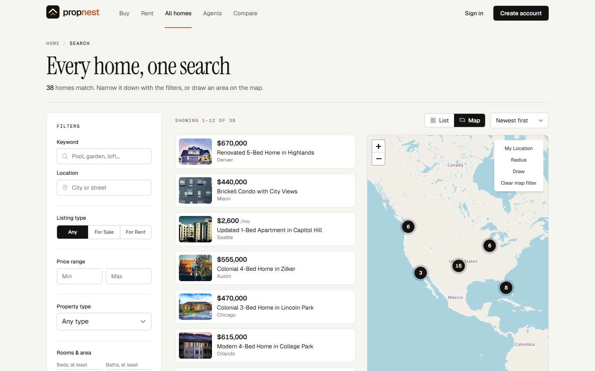
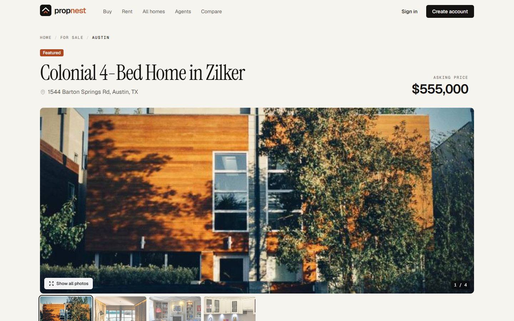
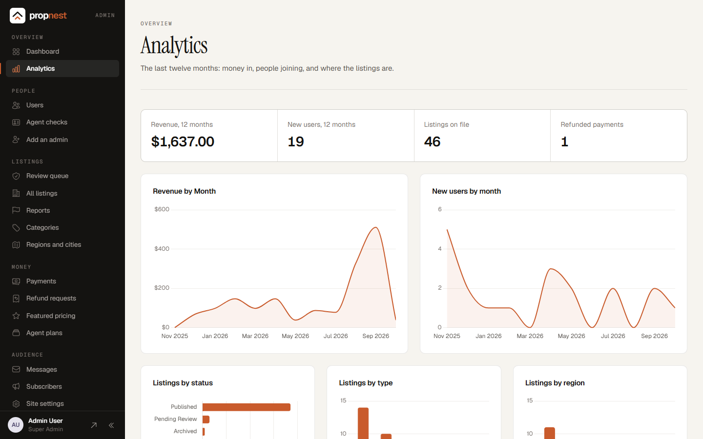
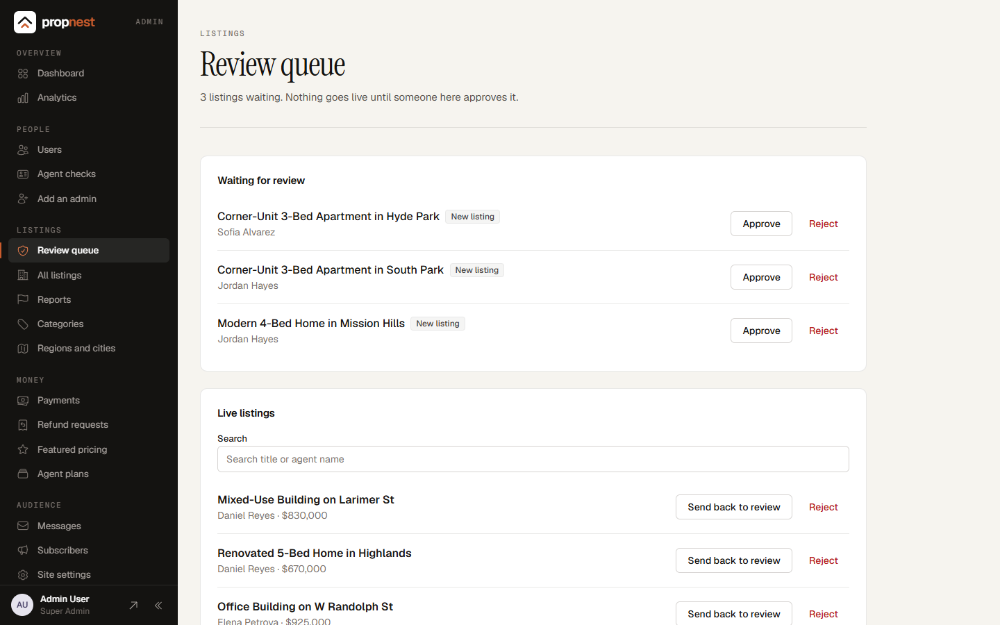
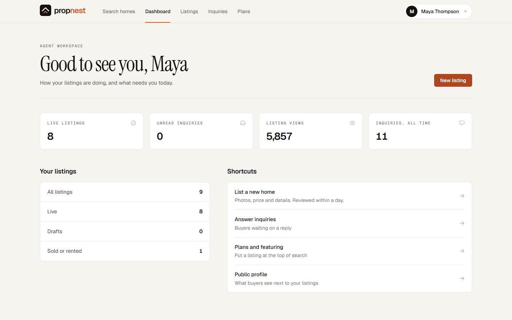
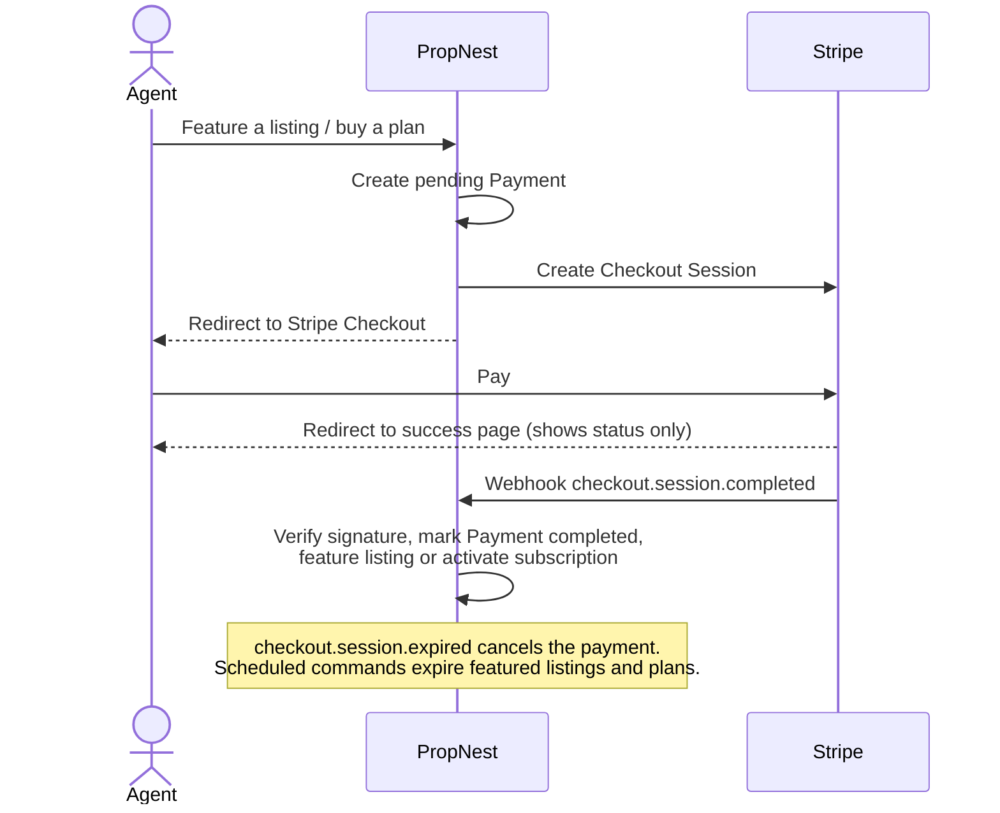

# PropNest

[](https://github.com/hashamkhan11/propnest/actions/workflows/tests.yml)


[](LICENSE)

A real estate marketplace where buyers search verified listings, agents sell subscriptions and featured placements, and admins moderate everything from one console.

Built with **Laravel 13**, **Livewire 3 / Volt**, **Tailwind CSS**, **Stripe** and **Leaflet**.

**Live demo: [propnest.gencodix.com](https://propnest.gencodix.com)**. Sign in with any [demo account](#seed-data) (password `password`). The demo resets itself on every restart, and the first visit after a quiet spell can take about a minute while the free server wakes up.

| | |
|---|---|
|  |  |
|  |  |
|  |  |

## Features

### Buyers
- Property search with filters (location, price, type, purpose, bedrooms, bathrooms, area, amenities) and an **interactive map** with clustered pins, radius and polygon search
- Favorites, **saved searches with email alerts** when a new listing matches
- Side-by-side **property comparison**
- Inquiry form to contact agents without exposing personal contact details

### Agents
- Agent profile, public profile page and agent directory
- Create and manage listings with multiple images (resized and thumbnailed by a queued job)
- Inquiry inbox with email notifications
- **Paid subscription plans** and **featured listings** through Stripe Checkout
- Refund requests for featured listings, with a **prorated refund amount** based on unused days

### Admins
- Moderation queue for new listings, agent verification and user reports
- User management (suspend / reinstate), admin accounts restricted to Super Admins
- Payments, refunds (processed through the Stripe API) and subscriber management
- Configurable categories, regions, featured pricing tiers, subscription plans and site settings
- **Analytics dashboard** with Chart.js

### Platform
- Four roles (Buyer, Agent, Admin, Super Admin) enforced by route middleware and policies
- Email/password auth with verification, plus **Google sign-in** (Socialite)
- **Stripe webhooks** (`checkout.session.completed`, `checkout.session.expired`) to activate payments reliably
- Scheduled commands that expire featured listings, subscriptions and stale payments
- Queued jobs for emails, image processing and saved-search matching

## Design

The interface is built to feel like a property publication, not a template:

- **Palette:** warm paper background (`#F6F4EF`), near-black ink for text and primary actions, and one terracotta accent (`#C95B2C`) used sparingly for featured items and the brand mark.
- **Type:** Geist for the interface, Instrument Serif for page headlines, and a small monospace label style for section kickers. Prices and counts use tabular figures so columns line up.
- **Structure:** hairline borders instead of heavy shadows, a consistent page header on every screen, and a dark sidebar that keeps the admin console separate from the public site.
- **Copy:** short, plain sentences in sentence case that say what happens next ("Send back to review", "Email me a reset link").

## Tech stack

| Layer | Tools |
|---|---|
| Backend | PHP 8.3, Laravel 13, Sanctum, Socialite, Intervention Image |
| Frontend | Livewire 3, Volt, Alpine.js, Tailwind CSS, Vite |
| Maps & charts | Leaflet + MarkerCluster, Chart.js |
| Payments | Stripe Checkout, Refunds API, webhooks |
| Testing | PHPUnit (280+ feature and unit tests) |
| Quality | Laravel Pint, Larastan (PHPStan level 5), Eloquent strict mode, GitHub Actions |
| Deployment | Docker (nginx + PHP-FPM), Render blueprint |

## Architecture notes

- **Livewire components** under `app/Livewire/{Public,Buyer,Agent,Admin,Property}` handle each page; business rules live in services, not components.
- **Services** (`app/Services`) hold the logic worth testing in isolation, e.g. `PropertySearchService` (filters and geo search), `FeaturedListingRefundCalculator` (prorated refunds) and `SubscriptionActivator`.
- **Enums** (`app/Enums`) model statuses for properties, payments, subscriptions, refunds and reports.
- **Jobs** (`app/Jobs`) keep slow work like emails and image processing out of the request.
- **Stripe** is the source of truth for payment state: checkout success pages only show status, and the webhook activates the payment.

### Payment flow



## Getting started

Requirements: PHP 8.3+, Composer, Node 20+, and MySQL or SQLite.

```bash
git clone https://github.com/hashamkhan11/propnest.git
cd propnest

composer install
npm install

cp .env.example .env
php artisan key:generate

# SQLite is the default in .env.example
touch database/database.sqlite
php artisan migrate --seed
php artisan db:seed --class=DemoSeeder   # optional: demo marketplace
php artisan storage:link

npm run build
composer run dev   # starts the server, queue worker, log viewer and Vite
```

### Seed data

`php artisan migrate --seed` creates only what a real install needs: settings, featured-listing pricing, subscription plans, amenities and one Super Admin. It is safe to run in production, where `ADMIN_PASSWORD` must be set.

`DemoSeeder` adds a realistic marketplace:
- 46 listings across 8 US cities, with photos, amenities and real neighborhood coordinates
- 7 agents and 15 buyers
- Subscriptions, featured placements and a year of payment history
- Refund requests, inquiries, favorites, saved searches, reports and contact messages

It uses a fixed random seed, so every run builds the same data.

| Role | Email | Password |
|---|---|---|
| Super Admin | `admin@propnest.test` | `password` |
| Admin | `moderator@propnest.test` | `password` |
| Agent | `agent@propnest.test` | `password` |
| Buyer | `buyer@propnest.test` | `password` |

Listing photos are public-domain (CC0) images from [StockSnap](https://stocksnap.io).

### Run with Docker

The production image (nginx + PHP-FPM) builds the frontend, runs migrations on start and, with `SEED_DEMO=true`, seeds the demo marketplace into a fresh SQLite database.

```bash
docker compose up --build
# open http://localhost:8080
```

### Optional integrations

Add these to `.env` to enable payments and Google sign-in:

```env
STRIPE_KEY=pk_test_...
STRIPE_SECRET=sk_test_...
STRIPE_WEBHOOK_SECRET=whsec_...

GOOGLE_CLIENT_ID=...
GOOGLE_CLIENT_SECRET=...
GOOGLE_REDIRECT_URI=http://localhost:8000/auth/google/callback
```

To receive webhooks locally: `stripe listen --forward-to localhost:8000/api/stripe/webhook`

To run scheduled tasks locally: `php artisan schedule:work`

## Tests and code quality

```bash
php artisan test     # 280+ feature and unit tests
composer lint        # Laravel Pint
composer analyse     # Larastan, PHPStan level 5
```

CI runs all three on every push, then builds the Docker image, boots it with demo data and checks the public pages.

## Deployment

The [live demo](https://propnest.gencodix.com) runs on Render's free plan behind a custom domain. See [docs/deployment.md](docs/deployment.md) for how to deploy your own copy and the settings a real production install needs.

## License

MIT
